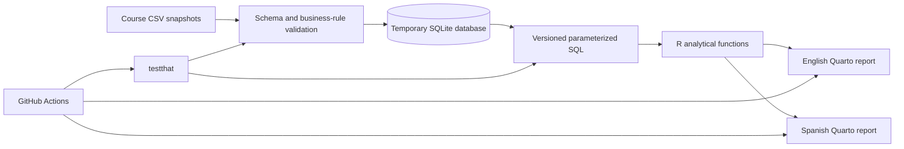
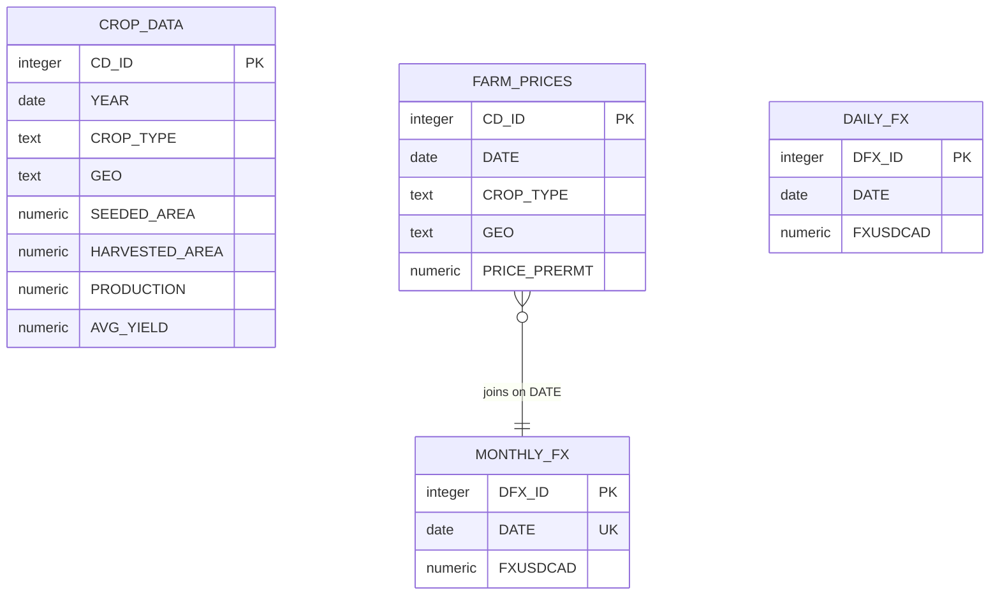

# Analytical architecture

The SQLite file is created during each execution and is never committed. The repository instead versions transparent CSV snapshots, validation rules, SQL queries and tests.

## Relational model

Crop production and farm prices describe the same crop and geography dimensions but have different time grains, so the report does not force a row-level relationship between them.
